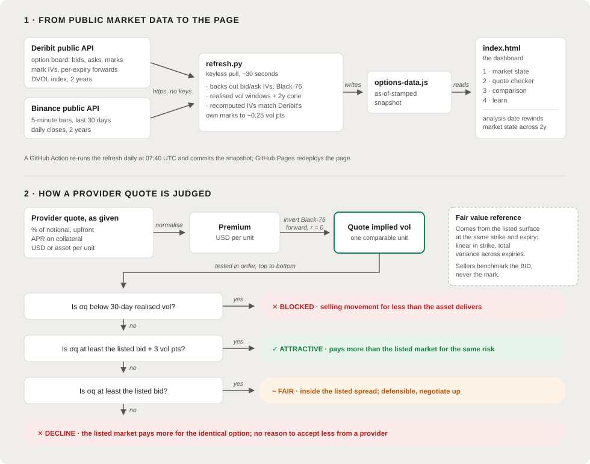
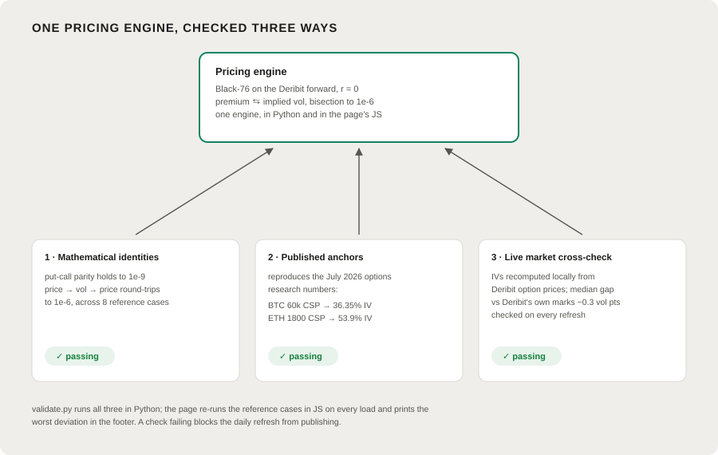

# kpk options hub

[](https://github.com/Taravello/KPK-options-hub/actions/workflows/refresh.yml)

**Live: <https://taravello.github.io/KPK-options-hub/>**

One page to decide whether an option subscription makes sense: the live market
state for volatility, a checker that converts any provider quote into implied
volatility and benchmarks it against the listed market, and a comparison table
that re-marks every saved quote against today's surface. Written for a mixed
audience: every verdict is in plain language, and every number is reproducible
from public data.

## How it works



The whole system is two moving parts. A keyless Python refresh pulls the
option board, forwards and DVOL from the Deribit public API and price history
from the Binance public API, backs out bid/ask implied vols locally with
Black-76, and writes one as-of-stamped snapshot. A dependency-free static page
reads that snapshot and does everything else client-side, including the
pricing of provider quotes.

## What it answers

1. **Is now a good time to be selling volatility at all?**
   30-day realised vs implied (the seller's margin), the DVOL percentile over
   the past year, a 2-year volatility cone, the full ATM term structure, and a
   one-paragraph regime verdict. An **analysis date** picker rewinds all of it
   to any day in the stored 2-year history, for both assets, so the vol state
   behind any past decision can be revisited.
2. **Is this specific provider quote good?**
   Enter a quote in any convention a provider uses: upfront % of notional, APR
   on collateral, USD or asset per unit. The hub backs out the quote's implied
   vol with Black-76 on the Deribit forward and compares it against the listed
   **bid** at the matched strike and tenor, the price the treasury could
   actually sell at instead.
3. **How do open opportunities compare?**
   Saved quotes are re-marked on every page load against the current surface
   and remaining tenor, then ranked by edge. A baseline grid shows the
   annualised premium the listed market itself pays a seller today across
   strikes and tenors, the floor any provider must beat.

## The verdict rules

Tested in order; the first hit decides.

| # | Test | Verdict |
|---|------|---------|
| 1 | Quote IV below 30-day realised vol | **Blocked.** Selling movement for less than the asset delivers loses money in expectation, whatever the headline yield |
| 2 | Quote IV at least the listed bid + 3 vol pts | **Attractive.** The provider pays more than the listed market for the same risk |
| 3 | Quote IV at least the listed bid | **Fair, negotiable.** Inside the listed spread; defensible if the provider brings operational advantages |
| 4 | Otherwise | **Decline.** The listed market pays more for the identical option |

Sellers are always benchmarked against the listed **bid**, never the mark:
the mid is where nobody trades.

## Accuracy



Pricing accuracy is a tested property, not an intention:

- [`validate.py`](validate.py) checks put-call parity to 1e-9, implied-vol
  round-trips to 1e-6, and reproduces the two published anchors from the
  July 2026 options research (BTC 60k CSP at 36.35% IV, ETH 1800 CSP at
  53.9% IV).
- The page's JavaScript engine re-prices the same reference cases on every
  load and reports its maximum deviation in the footer (typically under
  0.001 vol pts).
- [`refresh.py`](refresh.py) backs out IVs locally from Deribit prices and
  reports the median gap against Deribit's own mark IVs (~0.25 vol pts) as a
  live convention check.
- Quote conventions: CSP APR premium = APR × T × strike; covered-call APR
  premium = APR × T × spot; Black-76 on the per-expiry forward, r = 0.

## Data

| What | Source | Key |
|------|--------|-----|
| Option board, mark IVs, forwards | [Deribit public API](https://docs.deribit.com/) | none |
| DVOL history, 2 years | Deribit public API | none |
| Daily closes (2y), 5-minute bars (30d) | [Binance public API](https://developers.binance.com/docs/binance-spot-api-docs/rest-api) (Deribit perp fallback) | none |

Realised vol short windows (7/14/30d) use 5-minute bars; long windows, the
cone and past analysis dates use daily closes. Saved provider quotes live in
the browser's localStorage only; nothing leaves the machine and nothing is
committed to this repo.

## Security

Audited before internal sharing (August 2026). The posture in one list:

- **No secrets, by construction.** Both APIs are public and unauthenticated,
  the code reads no environment variables, and there is nothing to rotate or
  leak. Verified across the full git history: no keys, tokens, personal
  emails or local paths in any commit.
- **Provider quotes never leave the browser.** Saved quotes live in the
  viewer's localStorage, are shape-validated on load, and are never
  committed or transmitted anywhere.
- **The page makes no data requests.** It is a static file with one embedded
  snapshot; the only external fetch is the Lexend font from Google Fonts.
  Market data is pulled exclusively by `refresh.py` at build time.
- **Minimal CI surface.** The workflow holds `contents: write` on this repo
  only, uses no repository secrets, runs on schedule and manual triggers
  only, and its actions are pinned to commit SHAs. Python dependencies are
  version-pinned.
- **Mechanical push guard.** [`hooks/pre-push`](hooks/pre-push) blocks any
  push to the company org and any `.env` file in a pushed tree.
- **Clean identity.** Commits use the GitHub noreply address; no personal
  email appears in history.

## Run it locally

```bash
pip install -r requirements.txt
python refresh.py              # pull a fresh snapshot (~30s, no API keys)
python validate.py             # pricing engine self-test
```

Open [`index.html`](index.html), or share
[`kpk-options-hub.html`](kpk-options-hub.html): one self-contained file, no
server, no secrets.

## Configuration

Everything lives in [`config.yaml`](config.yaml): the asset list (add a
Deribit currency and a Binance symbol and it appears on the page), the
provider dropdown, the listed-universe bounds, realised-vol windows, and the
decision thresholds (±3 vol pts, block-below-realised).

## Refresh and deployment

[`refresh.yml`](.github/workflows/refresh.yml) runs at 07:40 UTC daily (plus
a manual **Run workflow** button): it refreshes the snapshot, re-runs the
pricing self-test, commits to `main`, and mirrors `main` to the `gh-pages`
branch, which GitHub Pages serves. No repository secrets are needed anywhere.

This repo lives on a personal account by design. The committed
[`hooks/pre-push`](hooks/pre-push) guard mechanically blocks pushes to the
company org; activate it after cloning with `git config core.hooksPath hooks`.

## Files

| Path | Role |
|------|------|
| `index.html` | The page (inline SVG charts, no dependencies) |
| `options-data.js` | Generated snapshot the page reads |
| `refresh.py` | The builder: Deribit + Binance to snapshot |
| `validate.py` | Pricing accuracy harness |
| `config.yaml` | Assets, providers, thresholds |
| `data/latest.json` | The snapshot, source of truth |
| `kpk-options-hub.html` | Single-file offline copy |
| `docs/how-it-works.svg` | The mechanism diagram above |
